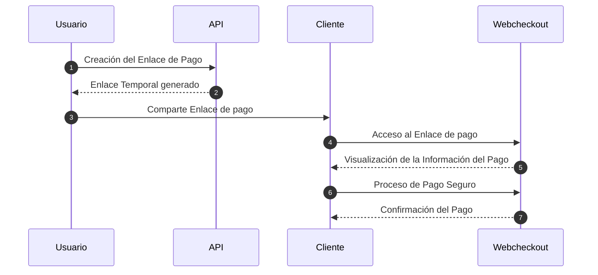

# Introducción

## Visión General
La API de Link de Pagos de Placetopay proporciona una interfaz de programación que permite a los desarrolladores integrar la funcionalidad de generación de sesiones de pago con la pasarela de pagos de Placetopay. Esta API facilita la creación de enlaces de pago únicos que pueden ser compartidos con los clientes para realizar transacciones seguras y convenientes a través de la pasarela de Placetopay.

## Descripción del Flujo (Usuario)
1. **Creación del Enlace de Pago:** Un usuario utiliza la API de Link de Pagos para crear un nuevo enlace de pago, especificando detalles como el nombre, el monto, la descripción y, opcionalmente, una fecha de vencimiento.
2. **Generación del Enlace Temporal:** La API genera un enlace temporal en la plataforma de "MICROSITIOS" que contiene toda la información del pago. Este enlace es único y se asocia con el enlace de pago recién creado.
3. **Acceso al Enlace:** Si la creación del enlace se realiza correctamente, se proporciona al usuario el enlace temporal, que es una URL única. El usuario puede acceder a esta URL utilizando su navegador web.
4. **Información del Pago:** Al abrir el enlace, el usuario visualiza toda la información relevante del pago, como el nombre de la compra, el monto a pagar y una descripción detallada. Además, se presenta un botón de "Pagar".
5. **Redirección a WebCheckout:** Si el usuario decide proceder con el pago, hace clic en el botón de "Pagar". En ese momento, es redirigido automáticamente a una sesión de "WebCheckout".
6. **Proceso de Pago Seguro:** En "WebCheckout", el usuario completa el proceso de pago de manera segura. Toda la información relacionada con el pago, como el monto y la descripción, se carga automáticamente en el proceso de pago para que el usuario pueda realizar la transacción de manera eficiente y precisa.
7. **Confirmación del Pago:** Después de completar el pago de manera exitosa, el usuario recibe una confirmación y un recibo de la transacción. Simultáneamente, se actualiza el estado del enlace de pago en la plataforma de "MICROSITIOS" para reflejar el pago realizado.

## Objetivo
El objetivo principal de esta documentación es proporcionar a los desarrolladores una guía completa sobre cómo utilizar la API de Link de Pagos de Placetopay para satisfacer las necesidades de integración de sus aplicaciones. Aquí encontrarás información detallada sobre los endpoints disponibles, los métodos de autenticación requeridos, ejemplos de uso y más.

## Audiencia
Esta documentación está dirigida a desarrolladores de software y equipos de ingeniería interesados en integrar la funcionalidad de pagos en línea de Placetopay en sus aplicaciones. Se espera que los usuarios tengan conocimientos básicos de desarrollo de software y estén familiarizados con conceptos como API REST y autenticación HTTP.

## Funcionalidades
Consulta como usar cada funcionalidad en el apartado de API - Link de pagos

- Creación de un link
- Consulta de un link
- Inactivación de un link

> #### Version Piloto
>
> Actualmente la API se encuentra en la versión piloto. Durante esta fase, se realizarán pruebas para certificar su efectividad y estabilidad. Se recomienda a los desarrolladores participantes utilizar la versión piloto para experimentar con la API y proporcionar retroalimentación valiosa para su mejora continua.